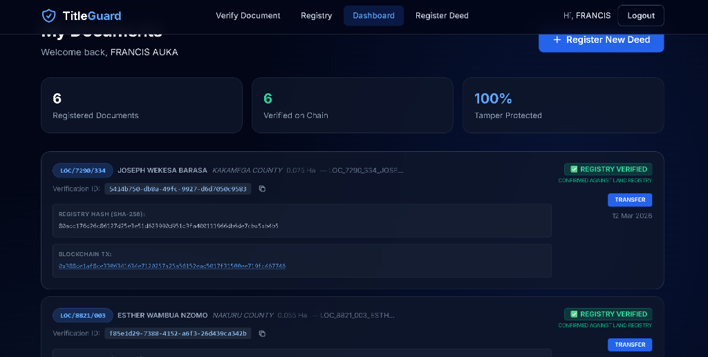
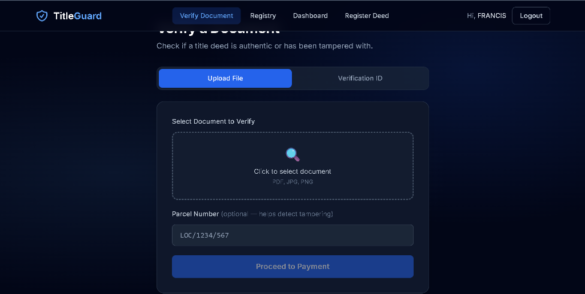
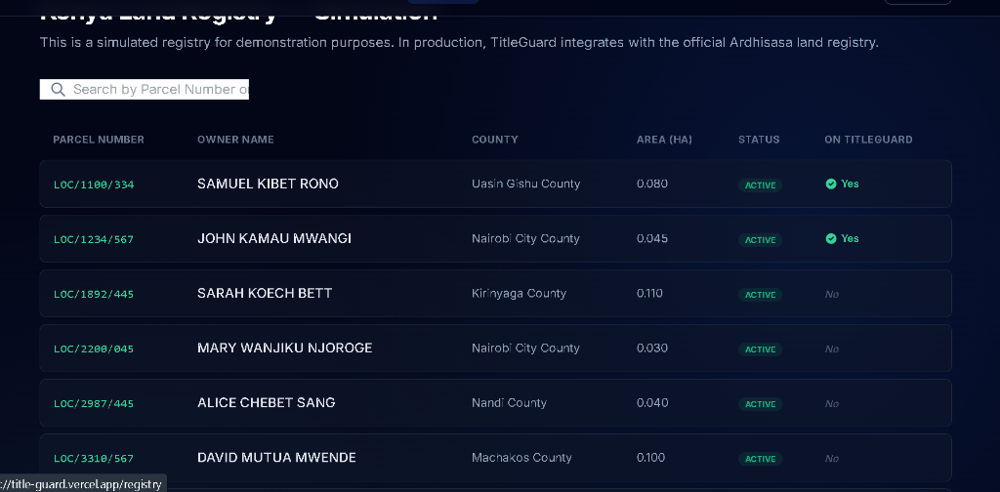
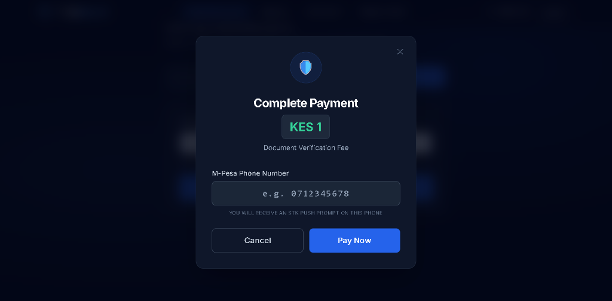

# 🛡️ Title Guard

**Blockchain-Based Property Document Authentication & Fraud Detection Platform**

Title Guard is a full-stack SaaS application built specifically for the Kenyan property market. It leverages the immutability of the Polygon blockchain and cryptographic SHA-256 hashing to ensure that property title deeds cannot be forged or tampered with.

---

## 🔴 The Problem
Land fraud is one of Kenya's most destructive financial crimes. Every year, thousands of Kenyans lose their life savings, homes, and inherited land to fraudulent title deeds — forged documents that are nearly impossible to detect with the naked eye.

The consequences are devastating:
- **Families lose their most valuable financial asset**
- **Buyers pay millions of shillings for land they will never legally own**
- **Court battles drag on for years** with no guarantee of recovery
- **Tampering is easy** in largely paper-based registry systems

There is currently no fast, accessible, or trustworthy way for an ordinary Kenyan to verify whether a title deed is authentic before completing a land transaction.

---

## ✅ The Solution
TitleGuard is a blockchain-powered verification platform that creates a **tamper-proof digital fingerprint** of title deeds on the Polygon blockchain.

- **Immutable Registration**: Document hashes are stored on-chain, making them impossible to alter.
- **Instant Verification**: Anyone can upload a deed to check it against the original record.
- **M-Pesa Integration**: Low-cost verification paid via STK Push, making it accessible to everyone.
- **Fraud Alerts**: Immediate detection of even the slightest modification (Match = Authentic, Mismatch = Fraud).

---

## 🌐 Live Demo & Testing

**🚀 Live Demo**: [https://title-guard.vercel.app/](https://title-guard.vercel.app/)

### 🔑 Test Account
Use the following credentials to explore the dashboard and verification flows:
- **Email**: `francisauka5@gmail.com`
- **Password**: `123456`

---

## 📸 Screenshots

### 1. User Dashboard
Shows all registered documents with their on-chain verification status.


### 2. Document Verification
The interface where users upload files to detect tampering.


### 3. Land Registry Simulation
TitleGuard cross-references data with this simulated official land registry.


### 4. M-Pesa Payment Flow
Seamless STK Push integration for processing verification fees.


---

## 🚀 Key Features

- **On-Chain Registration**: Store SHA-256 hashes permanently on Polygon Amoy Testnet.
- **Automated Data Extraction**: Extracts metadata (Owner, Parcel No, Area) directly from PDFs.
- **Registry Cross-Referencing**: Authenticates data against the Land Registry in real-time.
- **M-Pesa STK Push**: Native support for Safaricom M-Pesa mobile payments.
- **Tamper Detection**: Detects modifications down to a single pixel.
- **Secure by Design**: Documents are hashed in memory; file content is **never** stored on our servers.

---

## 🛠️ Technology Stack

### Backend
- **Node.js & Express**: Scalable REST API.
- **MongoDB & Mongoose**: Secure user and document metadata storage.
- **JWT**: Secure stateless authentication.
- **SHA-256 Hashing**: Standardized cryptographic fingerprinting.

### Frontend
- **React 18 & Vite**: Modern, high-performance user interface.
- **Tailwind CSS 3.4**: Premium, responsive dark-themed styling.
- **Axios**: Promised-based HTTP client with JWT interceptors.

### Blockchain
- **Solidity**: Smart contract for document registry logic.
- **Polygon Amoy Testnet**: Low-cost, high-speed L2 blockchain.
- **Ethers.js**: Interaction with smart contracts from the backend.

---

## 👥 TitleGuard Team

| Name | Role | Responsibilities |
| :--- | :--- | :--- |
| **Francis Auka** | Backend Developer | Server architecture, blockchain integration, API development |
| **Kelly Melchris** | Frontend Developer | React UI development, dashboard, document upload flows |
| **Faith Mbeneka** | UI/UX Designer | Experience design, wireframes, visual design system |
| **Harriet Wambura**| M-Pesa Integration | M-Pesa Daraja API, STK Push implementation |
| **Alicia Mbatha** | M-Pesa Integration | Payment callbacks, transaction verification logic |

---

## ⚙️ Installation & Setup

### 1. Clone the Repository
```bash
git clone https://github.com/francis-auka/title-guard.git
cd title-guard
```

### 2. Backend Setup
```bash
cd backend
npm install
cp .env.example .env
# Add MONGO_URI, JWT_SECRET, and CONTRACT_ADDRESS to .env
npm run dev
```

### 3. Frontend Setup
```bash
cd frontend
npm install
npm run dev
```

---

## 🔒 Security Policy

Title Guard uses a **Zero-Storage Policy**. When a user uploads a document, it is processed entirely in RAM. Only the resulting SHA-256 hash is compared or stored. Your property data remains your property.


